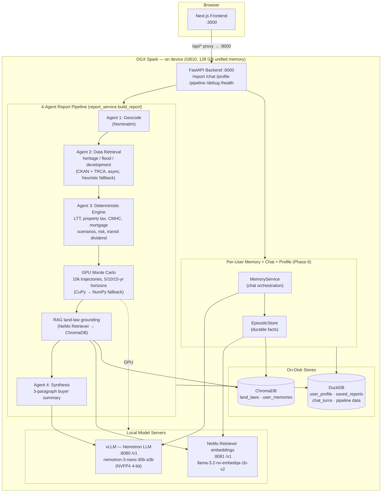
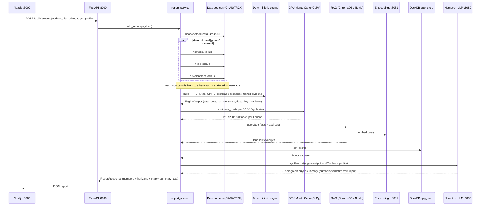
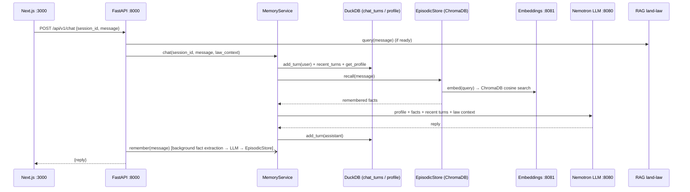

# Meridian Architecture

Meridian computes the **true 10-year cost of ownership** for a Toronto property from
an address, list price, and buyer profile. It pulls live Toronto Open Data + TRCA
flood data, runs a deterministic financial engine, simulates outcome ranges on GPU,
grounds the result in land-law context, and narrates it with a local NVIDIA Nemotron
LLM. **Everything runs on a single NVIDIA DGX Spark (GB10, 128 GB unified memory) —
no data leaves the device.**

## On-Device Topology

The 128 GB unified memory of the DGX Spark holds the Nemotron LLM, the NeMo
Retriever embedder, the Monte Carlo GPU buffers, and the per-user memory stores
**simultaneously** — there is no model swapping, and there is no cloud round trip.
The previous hosted-API cloud fallback for synthesis has been **removed**; synthesis
is now local-only.



## System Shape

Meridian is a mostly deterministic pipeline with one synthesis layer at the end.

## Agent Breakdown

### Agent 1: Intake

Responsibility:

- validate user input
- geocode address
- produce normalized property object

Input:

- address
- list price
- buyer profile
- optional mortgage assumptions

Output:

```json
{
  "address": "401 Richmond St W, Toronto",
  "normalized_address": "401 RICHMOND ST W",
  "list_price": 850000,
  "buyer_profile": "first_time",
  "lat": 43.647,
  "lon": -79.395,
  "ward": "TBD"
}
```

### Agent 2: Data Retrieval

Responsibility:

- fetch open datasets or cached local copies
- run spatial and address lookups
- return raw evidence objects

Preferred implementation:

- async Python with `httpx`
- cached shapefiles and CSVs loaded once at startup

Output examples:

- heritage match object
- RentSafeTO record
- flood intersection result
- nearby development count
- active/cleared permit summaries
- transit proximity features

### Agent 3: Deterministic Cost And Risk Engine

Responsibility:

- compute every number that matters
- convert raw evidence into flags
- generate scenario outputs

This is where the newer mortgage layer belongs.

Agent 3 should include:

- tax calculations
- rebate logic
- property tax projection
- mortgage insurance premium logic
- mortgage renewal scenarios
- flood loading
- risk-weighted adjustments
- transit dividend
- buyer-program benefit signals

Output should be strict JSON, for example:

```json
{
  "true_10_year_cost": 1247000,
  "components": {
    "ltt_total": 28850,
    "property_tax_10y": 39200,
    "mortgage_cost_base": 1150000,
    "risk_adjustments": 29000,
    "transit_dividend": -87000
  },
  "flags": [
    {
      "severity": "red",
      "title": "Heritage Part IV Designated"
    }
  ],
  "mortgage_scenarios": {
    "base": {},
    "bear": {},
    "bull": {}
  }
}
```

### Agent 4: LLM Synthesis

Responsibility:

- explain the structured output
- rank the most important issues
- produce concise buyer-facing guidance

Non-responsibility:

- inventing numeric outputs
- doing tax or mortgage calculations
- making unsupported claims about insurance or appraisal value

## Request Flow: `POST /api/v1/report`

`report_service.build_report` orchestrates the pipeline. Geocoding runs first
(everything downstream needs lat/lon); the three data-source agents then run
concurrently; the engine, GPU Monte Carlo, RAG, and synthesis run in sequence.
The buyer profile is pulled from the DuckDB app-store and fed into synthesis so
the summary reflects the user's economic situation. The numeric report is what the
frontend can persist via `/api/v1/reports/save`.



## Request Flow: `POST /api/v1/chat`

The chat endpoint composes a reply from the three-tier memory system (below) and
records the turn. Durable-fact extraction runs in the background so it never blocks
the reply.



## Phase 6: Per-User Memory, Chat, Profile, Saved Reports

A per-user subsystem layered on the same on-device stores. It has three memory tiers
(`services/memory/memory_service.py`):

- **Short-term** — a rolling conversation buffer: `chat_turns` in DuckDB
  (`app_store.add_turn` / `recent_turns`, last 10 turns per session).
- **Long-term structured** — the `user_profile` row (single implicit local user,
  `id=1`: name, email, phone, monthly income). Surfaced into the `/report`
  synthesis prompt as `buyer_situation` and into chat as the user profile.
- **Long-term episodic** — durable facts in ChromaDB collection `user_memories`
  (`services/memory/episodic_store.py`), embedded via the local NeMo Retriever
  server on `:8081`, cosine-searched on recall. Facts are extracted from each user
  message by the local Nemotron LLM in the background.

Supporting state lives in DuckDB (`services/storage/app_store.py`): `user_profile`,
`saved_reports` (full report JSON payloads), and `chat_turns`. New API routes
(`app/api/router.py`): `/profile` (GET/PUT), `/reports` + `/reports/save` +
`/reports/{id}`, and `/chat`. All reasoning, fact extraction, and embedding use the
local model servers only — no API key, no cloud.

## Local Model Servers

| Server | Port | Model | Used by |
| --- | --- | --- | --- |
| vLLM Nemotron LLM | `:8080` (`nim_local_url`) | `nemotron-3-nano-30b-a3b` (NVFP4 4-bit, ~19 GB) | `/report` synthesis, `/chat`, fact extraction |
| NeMo Retriever embeddings | `:8081` (`embedding_local_url`) | `llama-3.2-nv-embedqa-1b-v2` | RAG land-law retrieval, episodic memory embed/recall |

Synthesis (`services/synthesis/service.py`) POSTs OpenAI-compatible
`/chat/completions` to `:8080` only — **no hosted-API fallback**; on any failure it
returns `None` and the report degrades gracefully (numbers still render). The health
endpoint (`/api/v1/health`) probes `:8080` and `:8081` (`GET /models`) to drive the
frontend's on-device status badge.

## Deployment Shape

```text
Next.js Frontend (:3000)
      │  /api/* proxy
      ▼
FastAPI Backend (:8000)
      ▼
Deterministic Cost + Risk Engine  →  Structured JSON
      ▼
GPU Monte Carlo (CuPy, 5/10/15-yr)  +  RAG land-law (ChromaDB)  +  buyer profile
      ▼
Local Nemotron LLM (vLLM :8080, on-device)
      ▼
Buyer-friendly Summary
```

## Technical Recommendations

- Next.js + TypeScript for the frontend
- Tailwind CSS + `shadcn/ui` for rapid UI work
- Leaflet or Mapbox for property and risk visualization
- Recharts for simple breakdown charts
- Python 3.11
- FastAPI for the backend API
- `httpx` for async retrieval
- `pydantic` for structured schemas
- `geopandas`, `shapely`, and `pyproj` for spatial work
- local OpenAI-compatible Nemotron LLM endpoint on the DGX Spark (vLLM, `:8080`) — no cloud fallback

## Practical Build Order

1. Build Agent 3 schemas first so the rest of the system has a target contract.
2. Implement Agent 1 input normalization and geocoding.
3. Implement Tier 1 data retrieval modules.
4. Wire Agent 3 calculations.
5. Add Agent 4 synthesis only after deterministic outputs are stable.

## Key Architectural Decision

The main correction to preserve product integrity is this:

If Meridian claims "true cost of ownership," all financially material calculations should live in deterministic code paths. The LLM is presentation, not accounting.
