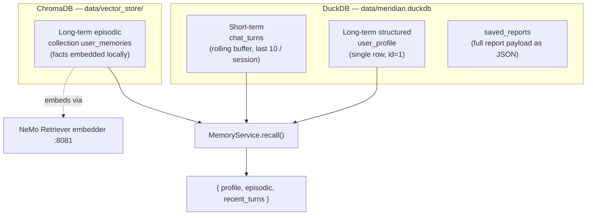

# Phase 6 — On-Device Memory, Chat & Saved Reports

## Goal

Add a persistent memory layer, a conversational assistant, an editable user profile, and saved reports — all running **entirely on the DGX Spark with no hosted API**. The same on-device Nemotron LLM that writes the report summary now also powers a chatbot that remembers the buyer across turns and across sessions, and the buyer's profile personalizes both the chat and the report synthesis prompt.

This phase also completes the local-first migration started in Phase 4: synthesis is now **local-only** — the hosted NVIDIA API fallback has been removed.

## What's New

- **Memory layer** in three tiers (short-term conversation buffer, long-term structured profile, long-term episodic facts).
- **Chat endpoint** (`POST /api/v1/chat`) that recalls memory + RAG land-law context and replies via the local LLM, extracting durable facts in the background.
- **Profile & saved-reports endpoints** backed by the same on-device DuckDB used by the data pipeline.
- **Personalized synthesis** — the buyer's profile and multi-horizon (5/10/15-year) simulations are injected into the report prompt.
- **Health badge** that probes the local LLM (:8080) and local embedding server (:8081).

## Everything Runs On-Device

| Component | Where it lives | Port / path |
|-----------|----------------|-------------|
| LLM (chat + synthesis + fact extraction) | vLLM serving `NVIDIA-Nemotron-3-Nano-30B-A3B` (NVFP4 4-bit, ~19 GB resident) | `http://localhost:8080/v1` |
| Embeddings (episodic memory + RAG) | local NeMo Retriever embedding server | `http://localhost:8081/v1` |
| Episodic memory | ChromaDB persistent collection `user_memories` | `data/vector_store/` |
| Profile, saved reports, chat turns | DuckDB | `data/meridian.duckdb` |

No request in this phase leaves the device. The model name and both endpoints are config-driven:

```python
# backend/app/core/config.py
nim_local_url: str = "http://localhost:8080/v1"
nim_model: str = "nemotron-3-nano-30b-a3b"
embedding_local_url: str = "http://localhost:8081/v1"
rag_embedding_model: str = "nvidia/llama-3.2-nv-embedqa-1b-v2"
rag_vector_store_path: str = "data/vector_store"
duckdb_path: str = "data/meridian.duckdb"
```

## Three-Tier Memory Architecture



- **Short-term** — `AppStore.add_turn()` appends every user/assistant message to `chat_turns`; `recent_turns(session_id, limit=10)` returns the last 10 turns for that session in chronological order. This is the rolling conversation buffer.
- **Long-term structured** — the `user_profile` row (`id=1`, single implicit local user, no auth) holds `name`, `email`, `phone`, `monthly_income`. It captures the buyer's economic situation.
- **Long-term episodic** — `EpisodicStore` writes durable fact strings to the ChromaDB `user_memories` collection (cosine space), embedded by the local server on :8081. `recall(query)` does a top-5 semantic lookup.

`MemoryService.recall(session_id, query)` fuses all three into a single context dict consumed by both chat and (via the profile) report synthesis.

## Chat Request Flow

```mermaid
flowchart TD
    C["Client"] -->|POST /api/v1/chat<br/>{session_id, message}| EP["chat route"]
    EP --> RAG["RAGService.query(message)<br/>(land-law context, if rag_enabled & ready)"]
    EP --> MEM["MemoryService.chat()"]
    RAG -. law_context .-> MEM

    subgraph MEM["MemoryService.chat()"]
        AT["add_turn(user)"]
        RC["recall(): profile + episodic + recent_turns"]
        SP["build system prompt<br/>(profile + facts + law_context)"]
        LLM["local Nemotron :8080<br/>/chat/completions"]
        AA["add_turn(assistant)"]
        AT --> RC --> SP --> LLM --> AA
    end

    MEM --> R["reply"]
    R --> C

    EP -.->|asyncio.create_task| REM["remember(message)<br/>(background, non-blocking)"]
    subgraph REM["remember()"]
        EX["fact extraction via local LLM :8080"]
        EMB["embed fact :8081"]
        CH["upsert → ChromaDB user_memories"]
        EX --> EMB --> CH
    end
```

The chat route gathers land-law context first (RAG, skipped silently on any error or when RAG is disabled), then calls `MemoryService.chat()`. The reply is returned immediately; `remember()` runs as a fire-and-forget background task so fact extraction never blocks the response.

`remember()` prompts the local LLM to return a JSON array of durable facts (budget ceilings, cash on hand, risk tolerance, preferred/avoided neighborhoods, income, life situation), and embeds each non-empty fact into episodic memory. If extraction fails or returns `[]`, nothing is written.

## Personalized Synthesis (Local-Only)

`SynthesisService` is now local-only — the hosted NVIDIA API path is gone. It posts to `nim_local_url` (:8080) using `settings.nim_model` and returns `None` on any failure so the report still renders without narration.

`report_service.build_report` reads the profile from the same on-device `AppStore` and passes it into synthesis:

```python
# backend/app/services/report_service.py (synthesis group)
self.synthesis.synthesize(
    ...,
    monte_carlo=monte_carlo,
    horizons=monte_carlo_horizons,
    profile=get_app_store(self.settings.duckdb_path).get_profile(),
)
```

Inside synthesis, the profile becomes a `buyer_situation` block (only non-empty fields), and the multi-horizon simulations become a `horizon_simulations` block, both added to the JSON context:

```python
if horizons:
    context["horizon_simulations"] = {
        h: {"p10": r.p10, "p50": r.p50, "p90": r.p90} for h, r in horizons.items()
    }
if profile:
    buyer_situation = {k: v for k, v in profile.items() if v not in (None, "")}
    if buyer_situation:
        context["buyer_situation"] = buyer_situation
```

The system prompt instructs the model to note how cost grows across the 5/10/15-year horizons and to ground its two action steps in the buyer's profile. Memory therefore feeds **both** the chat assistant and the report — the same on-device store personalizes everything.

## Endpoint Reference

| Method | Path | Purpose |
|--------|------|---------|
| `POST` | `/api/v1/chat` | RAG land-law lookup + `MemoryService.chat`; background fact extraction. Body `{session_id, message}` → `{reply}`. |
| `GET` | `/api/v1/profile` | Return the single `user_profile` row (empty object if unset). |
| `PUT` | `/api/v1/profile` | Upsert the profile (`name`, `email`, `phone`, `monthly_income`). |
| `POST` | `/api/v1/reports/save` | Persist a full report payload to `saved_reports`; returns `{report_id}`. |
| `GET` | `/api/v1/reports` | List saved-report summaries, newest first. |
| `GET` | `/api/v1/reports/{id}` | Return a saved report's full payload (404 if missing). |
| `GET` | `/api/v1/health` | Probe `:8080` (`llm_local`) and `:8081` (`embeddings_local`); returns active model name. |

## DuckDB Schema

`AppStore` is a process-wide singleton (`get_app_store(db_path)`) sharing the pipeline's DuckDB file. It creates three tables on first use:

```sql
CREATE TABLE IF NOT EXISTS user_profile (
    id             INTEGER PRIMARY KEY,   -- always 1 (single implicit local user)
    name           VARCHAR,
    email          VARCHAR,
    phone          VARCHAR,
    monthly_income DOUBLE,
    updated_at     TIMESTAMP DEFAULT current_timestamp
);

CREATE TABLE IF NOT EXISTS saved_reports (
    report_id     VARCHAR PRIMARY KEY,    -- uuid4 hex[:12]
    address       VARCHAR,
    list_price    DOUBLE,
    buyer_profile VARCHAR,
    true_10y_cost INTEGER,
    payload       JSON,                   -- full report
    created_at    TIMESTAMP DEFAULT current_timestamp
);

CREATE TABLE IF NOT EXISTS chat_turns (
    turn_id    VARCHAR PRIMARY KEY,       -- uuid4 hex[:12]
    session_id VARCHAR,
    role       VARCHAR,                   -- "user" | "assistant"
    content    VARCHAR,
    created_at TIMESTAMP DEFAULT current_timestamp
);
```

`upsert_profile` uses `INSERT ... ON CONFLICT (id) DO UPDATE` on the fixed `id=1` row. All access is guarded by an instance lock for thread safety.

## Health Badge

`/api/v1/health` GETs `/models` on each local endpoint with a 2 s timeout and reports readiness as booleans:

```json
{ "status": "ok", "llm_local": true, "embeddings_local": true, "model": "nemotron-3-nano-30b-a3b" }
```

The frontend uses this to show whether the on-device LLM and embedder are up before allowing chat/synthesis.

## Why This Is Local-First — the Spark Story

The DGX Spark's 128 GB unified memory lets four workloads coexist with **no model swapping**:

1. the Nemotron-3 Nano 30B LLM (NVFP4 4-bit, ~19 GB resident) serving chat, synthesis, and fact extraction,
2. the NeMo Retriever embedding model for episodic memory and RAG,
3. the Monte Carlo simulation buffers (10k trajectories on GPU), and
4. the per-user memory store (DuckDB + ChromaDB on local disk).

Because every inference, embedding, and database write happens on the box, **the buyer's financial profile never leaves the device** — income, budget, saved reports, and remembered facts all stay on-device. The hosted-API fallback that earlier phases carried has been removed entirely, so there is no path by which user data could reach the cloud. That is the heart of the Spark story: a private, personalized financial assistant that runs end-to-end on one machine.

## Modified / New Files

| File | Change |
|------|--------|
| `backend/app/services/storage/app_store.py` (new) | Singleton DuckDB `AppStore`: `user_profile`, `saved_reports`, `chat_turns`; profile/report/turn methods. |
| `backend/app/services/memory/memory_service.py` (new) | `MemoryService`: `recall()`, `remember()`, `chat()` against local LLM :8080. |
| `backend/app/services/memory/episodic_store.py` (new) | `EpisodicStore`: ChromaDB `user_memories`, embeddings via :8081. |
| `backend/app/api/routes/chat.py` (new) | `POST /api/v1/chat` — RAG + memory chat + background `remember()`. |
| `backend/app/api/routes/profile.py` (new) | Profile + saved-reports endpoints. |
| `backend/app/schemas/profile.py` (new) | `ProfileIn/Out`, `SavedReportSummary`, `SaveReportResponse`. |
| `backend/app/api/routes/health.py` | Probes `:8080` and `:8081`; returns model name. |
| `backend/app/api/router.py` | Registers `profile` and `chat` routers. |
| `backend/app/services/synthesis/service.py` | Local-only (no cloud fallback); injects `buyer_situation` + 5/10/15-year `horizon_simulations`. |
| `backend/app/services/report_service.py` | Passes `AppStore` profile into synthesis. |
| `backend/app/core/config.py` | `nim_local_url`, `embedding_local_url`, `nim_model`. |
